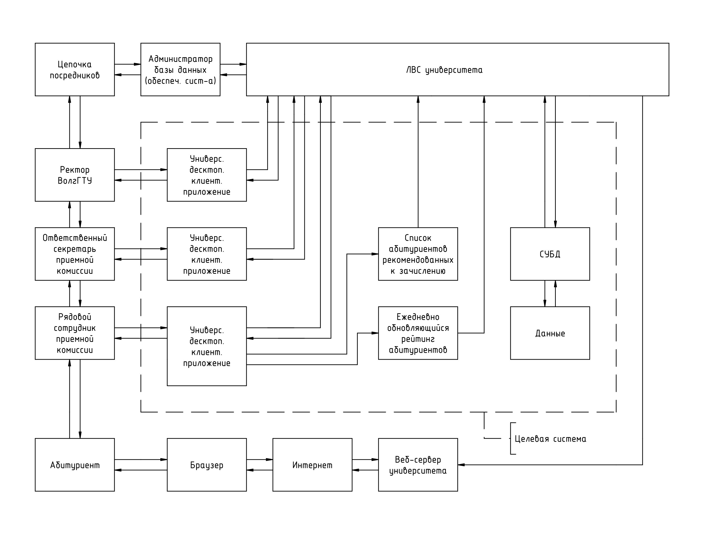

# Приемная комиссия ВолгГТУ

## Цель работы
Проектирование базы данных для информационной системы, имитирующей работу приемной комиссии ВолгГТУ (задание по дисциплине "Базы данных"). 

Создание репозитория на GitHub является частью задания.

Руководитель: к. т. н. А. А. Соколов (каф. САПР и ПК).

## Концептуальное проектирование БД

### Описание предметной области
Работа приемной комиссии ВолгГТУ основана на **"Правилах приема в федеральное государственное бюджетное образовательное учреждение высшего образования "Волгоградский государственный технический университет" на обучение по образовательным программам высшего образования - программам бакалавриата, программам специалитета, программам магистратуры на 2020/21 учебный год"** от 25.06.2020 (файл [PP.pdf](./ЛР1_версия3/PP.pdf) в каталоге `ЛР1_версия3`).

Для понимания принципов приема в университет особое значение имеют п. 10, 11, 12, 14, 17 раздела 1 данного документа. 

### Системная схема
Разрабатываемая информационная система в операционном окружении и ее обеспечивающая система изображены на системной схеме согласно п. 4.1.44 ГОСТ Р 57193-2016

### Диаграмма состояний системы
Для описания алгоритма работы системы используется схема ассоциированного с ней конечного автомата (диаграмма состояний UML)

### Функциональные требования
Функциональные требования к разрабатываемой системе описываются диаграммой прецедентов UML

### Нефукциональные требования
Нефункциональные требования к разрабатываемой информационной системе:

1.	Разрабатываемая информационная система должна быть кросс-платформенной.
2.	При разработке должны по возможности использоваться технологии с открытым исходным кодом.

### ER-диаграмма

## Логическое проектирование БД

### Нормализация реляционных БД

Для пояснения принципов нормализации реляционных БД до 3НФ автором была создана поясняющая схема

### Реляционная схема после нормализации и корректировки
#### Часть 1

#### Часть 2

#### Часть 3

#### Часть 4

#### Часть 5

#### Полная схема (сумма всех частей)

### Генерация тестовых данных
#### Общая схема генерации тестовых данных
Для описания принципа генерации тестовых данных автором подготовлена блок-схема в соответствии с ГОСТ 19.701-90

#### План генерации тестовых данных

Учесть, что пустая клетка в таблице означает отсутствие изменений по сравнению с предыдущей группой значений.

Также см. файл `План генерации.odt` в каталоге `ЛР2`

#### Сценарии для генерации тестовых данных
Cм. файлы `*.py` в каталоге `ЛР2`

### Тестовые данные
См. каталог `DATA` в каталоге `ЛР2`

## Физическое проектирование БД
### Выбор СУБД
В качестве СУБД выбрана СУБД [PostgreSQL](https://www.postgresql.org/) (версия 9.6). Выбор был обусловлен следующими причинами: 

1.	Данная СУБД является свободным кросс-платформенным ПО.
2.	Она имеет относительно невысокие системные требования.
3.	При этом обладает достаточным набором опций для обеспечения информационной безопасности.
4.	В последнее время ее популярность растет (согласно [DB-Engines](https://db-engines.com/en/ranking_trend)).
5.	Имеется подробная документация на русском языке.

Популярность СУБД согласно [DB-Engines](https://db-engines.com/en/ranking_trend):

Сравнение различных СУБД (цитата из моей курсовой работы по дисциплине "Методы анализа нечеткой информации"):

Ограничения в 12-й версии PostgreSQL из [статьи](https://ru.wikipedia.org/wiki/PostgreSQL) на Википедии:

### Установка PostgreSQL
Для установки СУБД PostgreSQL на компьютер с ОС Debian GNU/Linux 9.12 (stretch) необходимо выполнить следующие команды от суперпользователя:

	apt-get update
	apt-get install postgresql
	apt-get install postgresql-client

### Настройка PostgreSQL
Для комфортной отладки сценариев решено было настроить механизм аутентификации ролей. [Роль](https://postgrespro.ru/docs/postgresql/9.6/database-roles) в PostgreSQL - сущность, которая может владеть объектами и иметь определенные права в БД. Она может представлять пользователя, группу пользователей или и то, и другое. 

Роль в БД PostgreSQL не имеет ничего общего с пользователями ОС. Такая путаница возникла из-за способов аутентификации ролей **ident** и **peer**. 

Основные [способы](https://postgrespro.ru/docs/postgresql/9.6/auth-methods) аутентификации ролей в PostgreSQL представлены в следующей таблице:

Решено было для локальных подключений установить метод аутентификации `trust`. Для этого пришлось отредактировать файл `pg_hba.conf`, который у автора расположен по следующему адресу:

	/etc/postgresql/9.6/main/pg_hba.conf

Отредактированный файл [pg_hba.conf](./ЛР3/pg_hba.conf) был добавлен в репозиторий.

### Запуск PostgreSQL

Для локального подключения к серверу PostgreSQL после проведенной выше настройки механизма аутентификации ролей достаточно набрать в терминале команду:

	psql -U postgres

Где [psql](https://postgrespro.ru/docs/postgresql/9.6/app-psql) - официальный терминальный клиент для работы с PostgreSQL, опция `U` означает роль, в качестве которой выбрана роль `postgres` - роль суперпользователя PostgreSQL по умолчанию.

### Создание БД

Решено было при создании БД использовать описанный выше терминальный клиент **psql**. Основная причина - обязательное требование по наличию навыков практической работы с **PostgreSQL** в среде **psql** для получения сертификата ["Администрирование PostgreSQL. Профессионал"](https://postgrespro.ru/education/cert) от компании Postgres Professional (ООО "ППГ").

Основные команды **psql** приведены в таблице:

#### Сценарий на языках SQL и PL/pgSQL

Для создания БД по приведенной выше реляционной схеме и наполнения ее подготовленными выше данными, представляющими собой файлы формата `*.csv` был подготовлен включенный в состав репозитория [сценарий database_creation.sql](./ЛР3/database_creation.sql) на языках **SQL** и **PL/pgSQL**.

Запустить его можно следующим образом (из каталога со сценарием):

	psql -U postgres -f database_creation.sql
	
Получившаяся БД будет называться `admission_office`.

#### Снимки экрана с содержимым таблиц

Выведем на список доступных таблиц при помощи команды `\dt`:

Выведем содержимое таблицы `faculty`:

Совершим какой-нибудь запрос **SELECT**. Так, согласно приведенному выше "Плану генерации тестовых данных" на ФПИК подали документы **40 абитуриентов**, имеющих лишь аттестат о среднем общем образовании. Попробуем вычислить их количество при помощи сведений из БД:

Очевидно, что полученное число абитуриентов соответствует данным из "Плана генерации тестовых данных".

### Генерация реляционной схемы на основе БД
Реляционная схема сгенерирована при помощи [SchemaSpy](http://schemaspy.org/) - консольного java-приложения с открытым исходным кодом, автоматически генерирующего документацию для БД.

[Краткая инструкция](https://gist.github.com/dpapathanasiou/c9c6236a410e9d018ae0) по использованию **SchemaSpy**:

1.	Скачать jar файл SchemaSpy.
2.	Скачать jar файл драйвера JDBC для PostgreSQL.
3.	Поместить JDBC драйвер в один каталог с jar-файлом SchemaSpy.
4.	Запустить jar-файл SchemaSpy с параметрами, указанными ниже.

Пример запуска **SchemaSpy**:

	java -jar JarФайлSchemaSpy
	-t pgsql
	-host localhost
	-db ИмяБазыДанных
	-o КаталогДляВыходныхФайлов
	-u РольБД
	-dp . (путь к JDBC драйверу)
	-p Пароль

**SchemaSpy** в процессе генерации документации:

В результате была сгенерирована реляционная схема:

Полный отчет **SchemaSpy** можно посмотреть [здесь](https://codedesign2763.github.io/SchemaSpyOutput/index.html).

### Сравнение сгенерированной на основе БД реляционной схемы с изначальной

Заметны 2 отличия сгенерированной при промощи **SchemaSpy**  реляционной схемы от изначальной:

1.	Кратность отношений "один ко многим" отображается односторонне, что не совсем корректно, т.к. при этом не учитывается влияние ограничения `NOT NULL` для внешнего ключа, но это недостаток самой **SchemaSpy**.
2.	В случае кратности отношения "один ко многим" отображается лишь вариант "от нуля до бесконечности".

Второе обстоятельство объяснить можно так (см. рисунок):

На рисунке благодаря внешнему ключу сущности `faculty` на каждый филиал должно приходиться от 1 до бесконечности факультетов. Однако в подобной ситуации ничего не мешает создать дополнительный экземпляр сущности `branch`, на который не будет ссылаться ни один экземпляр сущности `faculty` и запретить такое действие описанными средствами никак нельзя, что и обуславливает невозможность варианта "от единицы до бесконечности" для отношений кратностью "один ко многим" в реляционных БД:

### Дополнительное задание

#### Условие задачи

1.	Разработать базу данных музея (5-10 таблиц).
2.	Создать базу данных при помощи написанного вручную SQL-скрипта (**create database**, **create table**).
3.	Написать 10 дополнительных запросов **alter table**.
4.	Написать 10 дополнительных запросов **insert**.
5.	Написать 2 дополнительных запроса **rename**.
6.	Написать запросы **drop table** и **drop database**.
7.	Сгенерировать реляционную схему на основе базы данных и сравнить ее с таковой, использовавшейся при проектировании.

#### ER-диаграмма для доп. задания

#### Реляционная схема для доп. задания

#### SQL-скрипт для доп. задания

Подготовлен [сценарий](./ЛР3/database_creation2.sql) на языке SQL.
Результат его выполнения доступен по [ссылке](./ЛР3/database_creation2.sql.txt).

#### Реляционная схема, сгенерированная при помощи SchemaSpy

С учетом описанных выше замечаний для основной БД, можно считать, что сгенерированная реляционная схема адекватно отражает реляционную схему, созданную вручную на этапе логического проектирования.

[Полный отчет](https://codedesign2763.github.io/OutputAddtask/index.html), сгенерированный при помощи SchemaSpy.

## Язык SQL

### Задание

Необходимо написать для своей базы данных как минимум 70 SQL-запросов. Обязательно в них должны входить указанные ниже запросы (число в скобках носит рекомендательный характер). Приветствуется добавление собственных запросов с теми операторами, которые ниже не указаны.

1.	Запросы, которые вы указали в функциональных требованиях (комментарием указать, что за требование) (20 шт.+)
2.	INSERTы для своей БД или БД одногруппника из предыдущей лабораторной работы (10 шт.+)
3.	UPDATE (с WHERE) (7 шт.+), можно условно, например, изменить заранее созданные некорректные данные
4.	DELETE с WHERE (5 шт.+), можно условно, например, удалить заранее созданные некорректные данные
5.	SELECT, DISTINCT, WHERE, AND/OR/NOT, IN, BETWEEN, IS NULL, AS (25 шт.+)
6.	LIKE (5-7 шт.+)
7.	COUNT, MAX, MIN, SUM, AVG (10 шт.+)
8.	GROUP BY, HAVING (7 шт. +)
9.	ORDER BY, ASC|DESC (5-7 шт. +)
10.	Вложенные SELECTы (2-3 шт.)
11.	SELECT INTO (1-2 шт.), можно в какую-то тестовую, специально созданную таблицу
12.	INSERT SELECT (1-2 шт.), можно в какую-то тестовую, специально созданную таблицу
13.	UNION (ALL), EXCEPT, INTERCEPT какой-то из них на выбор (2-3 шт.)
14.	JOIN (20 шт.+): INNER, OUTTER (LEFT, RIGHT, FULL), CROSS, NATURAL, в общем, разных
15.	LIMIT (3-5 шт.+)
 
Также приветствуется использование других SQL-команд, о которых рассказывалось на лекциях, но которые в этом списке не приведены.

### Блок-схема обработки данных для запроса SELECT

В результате экспериментов автором была составлена блок-схема обработки данных (ГОСТ 19.701-90) для запроса SELECT - наиболее часто использовавшегося запроса в рамках данной работы.

### Код сценария с запросами

Подготовлен [сценарий](./ЛР4/queries.sql) с запросами на языке SQL. Результат его выполнения доступен по [ссылке](./ЛР4/queries.sql.txt).

### Приблизительная статистика по запросам (включая подзапросы)

### Снимки экрана с отдельными запросами

#### Рейтинг абитуриентов

##### Функция get_enr_rating

##### Вызов функции

##### Результат выполнения

#### Список абитуриентов, рекомендованных к зачислению

##### Функция get_enr_adm_list

##### Вызов функции

##### Результат выполнения

## Взаимодействие с базой данных из приложения

### Задание

1.	Спроектировать архитектуру приложения на верхнем уровне (диаграмма классов) с описанием основных модулей приложения.
1.	Запланировать, как в итоге будет реализован прототип приложения: настольное приложение, веб-приложение, мобильное приложение, простейшая компьютерная игра, консольное приложение (при хорошем качестве исполнения). Учесть это при проектировании.
1.	Выбрать язык программирования и другие технологии (например, для интерфейса) для реализации лабораторной работы.
1.	Изучить и выбрать библиотеку для подключения к своей СУБД на своём языке программирования в рамках выбранных технологий.
1.	Реализовать простейшее приложение для подключения к собственной БД в СУБД и протестировать получение, добавление, редактирование и удаление данных с помощью отправки SQL-запросов и чтения результатов как минимум для 2 таблиц из своей БД.
1.	Реализовать получение данных по хотя бы 2 аналитическим запросам из функциональных требований.
1.	В качестве интерфейса пользователя в этой лабораторной работе достаточно вывода данных на консоль, на пустую веб-страницу или в текстовый файл (простой, CSV, JSON). Аналогично передавать данные в программу можно из консоли или из файла.
1.	Исходный код программы коммитить в репозиторий (если есть).
1.	Использовать классы предметной области и паттерн Репозиторий или луковую архитектуру.
1.	Соблюдать Coding conventions для своего языка программирования.

### Краткое описание использованных инструментов и технологий

-	OC: Debian GNU/Linux 9.12 "Stretch".
-	IDE: Geany 1.29.
-	Язык программирования: Java (OpenJDK 11.0.6).
-	Графический интерфейс: библиотеки Swing и AWT.
-	СУБД: PostgreSQL 9.6.19.
-	Подключение к СУБД: JDBC (пакет java.sql).
-	Драйвер для СУБД PostgreSQL: официальный, версия 42.2.18.
-	Создание UML-диаграмм: PlantUML (версия компилятора 1.2020.18).

### Java Code Conventions

Согласно статье на [Википедии](https://ru.wikipedia.org/wiki/%D0%A1%D1%82%D0%B0%D0%BD%D0%B4%D0%B0%D1%80%D1%82_%D0%BE%D1%84%D0%BE%D1%80%D0%BC%D0%BB%D0%B5%D0%BD%D0%B8%D1%8F_%D0%BA%D0%BE%D0%B4%D0%B0), стандарт оформления кода (coding conventions) - набор правил и соглашений, используемых при написании исходного кода на некотором языке программирования. Наличие общего стиля программирования облегчает понимание и поддержание исходного кода, написанного более чем одним программистом, а также упрощает взаимодействие нескольких человек при разработке программного обеспечения. 

Официальный стандарт оформления кода для языка Java:
[Code Conventions for the Java Programming Language](https://www.oracle.com/java/technologies/javase/codeconventions-contents.html)

Тот же документ в ввиде [файла PDF](https://www.oracle.com/technetwork/java/codeconventions-150003.pdf).

### Диаграмма классов

### Код программы

#### Основная программа

[Класс DBApp](./ЛР5/dbapp/DBApp.java)

#### Экранные формы

[Класс AuthForm](./ЛР5/dbapp/AuthForm.java)

[Класс MainForm](./ЛР5/dbapp/MainForm.java)

[Класс SpecialityForm](./ЛР5/dbapp/SpecialityForm.java)

#### Интефейс для работы с БД

[Интерфейс DBConnectionIface](./ЛР5/dbapp/DBConnectionIface.java)

[Его реализация для работы с  PostgreSQL](./ЛР5/dbapp/PGSQLDBConnection.java)

#### Интерфейс для вывода данных из БД

[Интерфейс DBProcIface](./ЛР5/dbapp/DBProcIface.java)

#### Классы предметной области

[Класс Speciality](./ЛР5/dbapp/Speciality.java)

#### Классы для хранения результатов запросов

[Класс QueryResult](./ЛР5/dbapp/QueryResult.java)

[Класс ConnectionResult](./ЛР5/dbapp/ConnectionResult.java)

### Команды для компиляции, сборки и запуска приложения

Команда для компиляции проекта: (в каталоге dbapp)
`javac  *.java`	

Команда для сборки JAR-архива: (в каталоге dbapp)
`jar cfm DBApp.jar Manifest.txt *class readme.txt`

См. также файл [Manifest.txt](./ЛР5/dbapp/Manifest.txt).

Команда для запуска приложения из JAR-архива:
`java -jar DBApp.jar`

### Снимки экрана

#### Окно авторизации

#### Главное окно

#### Получение данных из таблицы Speciality

#### Добавление данных в таблицу Speciality

#### Редактирование данных из таблицы Speciality

#### Удаление данных из таблицы Speciality

### Краткая инструкция по использованию приложения 

1.	Установить СУБД PostgreSQL.
2.	Клонировать репозиторий при помощи команды:
`git clone https://github.com/CodeDesign2763/DatabaseTask`
2.	Выполнить сценарий `database_creation.sql` из каталога `ЛР3` для создания БД и наполения ее данными.
3.	Убедиться, что файл `postgresql-42.2.18.jar`, содержащий JDBC-драйвер для СУБД PostgreSQL, находится в одном каталоге с файлом `DBApp.jar`.
4.	Запустить приложение из JAR-архива:
`java -jar DBApp.jar`
5.	При авторизации ввести логин и пароль, соответствующие роли PostgreSQL, от которой был выполнен сценарий `database_collection.sql`.

